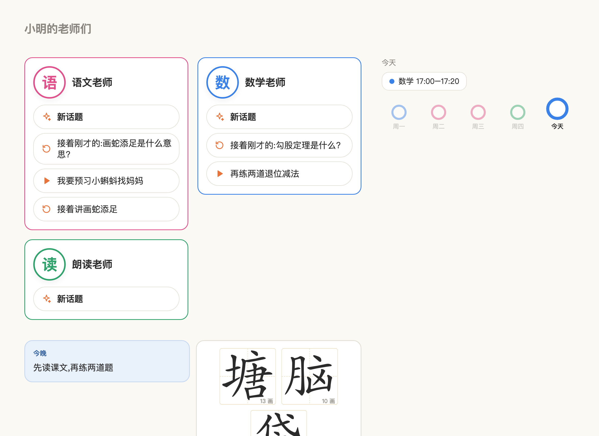
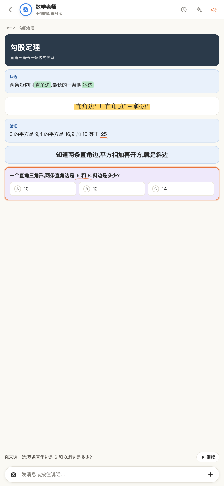
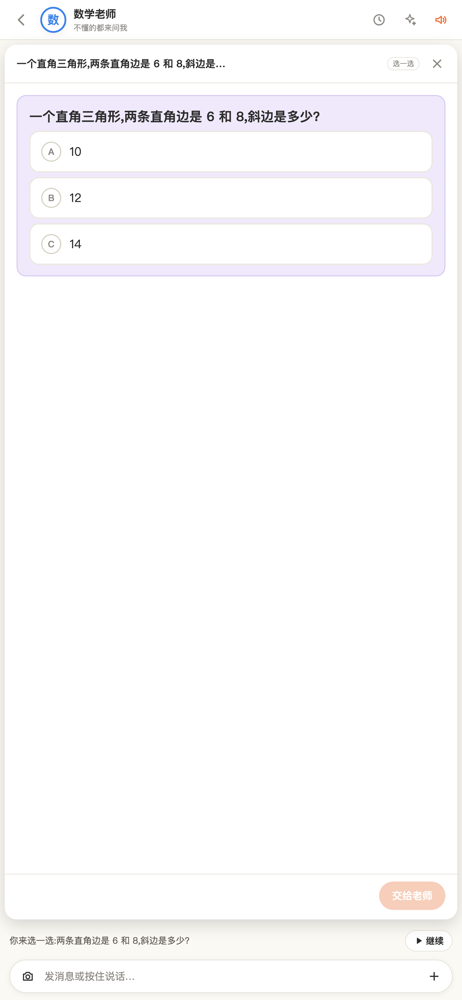
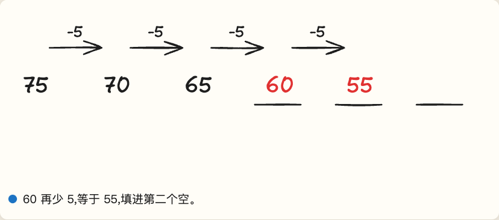

# cotutor 家长手册

> 给只想用、不改代码的家长。装好、建一个孩子的老师团、在页面上把老师配好、iPad 上给孩子用。命令只有五条,其余都在浏览器里点。改代码的看《开发者手册.md》。

## 1. 装

需要三样:

- **Node**(≥ 22.18):<https://nodejs.org> 装 LTS 版。
- **一个会说话的 AI 命令行**:Claude Code(`npm i -g @anthropic-ai/claude-code`,登录一次)或 Qwen Code(`npm i -g @qwen-code/qwen-code`)。老师就是它们跑出来的。
- **cotutor**:`npm i -g cotutor`。

可选:**voxtell**(老师的声音,不装就用浏览器自带的声)、**mkcert**(iPad 上按住说话要用,`brew install mkcert && mkcert -install`)。

## 2. 建老师团

```sh
cotutor init ming --name 小明
cotutor doctor
cotutor serve
```

第一条在 `~/cotutor/ming/` 建一个孩子的老师团(孩子端标题是「小明的老师们」):六位老师(数学、语文、朗读、作业老师、规划、画图)、账本、对话目录、一份 `cotutor.json`。第二条逐项体检,不过的每条都带修复命令。第三条起服务,打印两个网址:孩子端 `/`,家长端 `/parent`。

后两位老师孩子看不到:规划老师只和你打交道,画图老师在背后做讲解动画(第 4 章)。

`~/cotutor/ming/` 里全是你家的数据,建议 `git init` 一下,改坏了能回退。

不想先花钱就看看孩子端长什么样:`cotutor mock` 起一份模拟接口,板书、卡、舞台都能点,不经真实老师,也不需要先 init。

## 3. 孩子端 `/`:一页板书

iPad 或任何浏览器打开。孩子先看到自己的老师们、今天有什么课、这一周走到哪了;画图老师做好的东西也会堆在这里:



> 本章三张图都截自 `cotutor mock`(不花钱、不需要 workspace,自己也能开来点)。图里的「今天可以问」那几个话头目前只有 mock 里有,真用起来的首页没有这一行。

点一位老师进去,就是这位老师的**板书页**。孩子问一句,老师答一次,板上就多**一节**。

### 3.1 一节是什么样



- **卡先铺开**:老师这一节要用的卡一次摆在板上。
- **讲稿一句一句念**:念到哪句,那张卡就**亮起来**(橙色描边),卡上对应的词**画出标注**——正在定义的词绿底、公式和要记住的一句荧光黄、关键数字橙色下划线、选项紫框、标题里的词画圈,线条是当场描出来的,并滚到那张卡。
- **末句是问句就停下**:右下角出现「继续」。孩子可以直接说话回答,也可以点「继续」听下一节。
- **底下那条字幕**就是老师正在说的那句。孩子随时能按暂停。

输入条照着孩子熟悉的样子做:**相机 | 发消息或按住说话 | 加号(相册)**。按住说话用的是浏览器自带的识别(Safari 和 Chrome 有,没有就只剩打字)。卡按颜色分角色:蓝是定义与结论,绿是方法,米色是事实与例子,紫是要孩子做的题,深色是封面,白底是公式与图;颜色的值在第 6 章说的主题文件里,能改。平板横屏时一行可以放两三张卡(由老师那轮的「排版」定,手机上自动折成一列)。

### 3.2 点一张卡,进舞台

点板上任何一张能做的卡,它会放大成**舞台**盖住板书那块,讲稿暂停:



选完、填完、画完,点「交给老师」,老师下一节口头说对不对。**卡上永远不画对错**——对错只在老师嘴里。孩子做过的选择和填的字存在自家电脑上,重开页面还在。

老师这一节的末句是问句、又刚好锚在一张能做的卡上时,舞台会自动打开,孩子不用去找。

### 3.3 卡有八种

| 卡 | 孩子看到什么 |
|---|---|
| 一段字 | 标题卡、要点、公式、一步一步;只看不动 |
| 点读 | 一段一段的文言或课文,点一下念这一段(老师配了音色就是她的声音) |
| 选择题 | 点开是大按钮,选完交给老师 |
| 填空 | 点开逐空输入 |
| 图片 | 点开能放大、双指缩放 |
| 讲解动画 | 点开一步一步画出来(画图老师做的,见第 4 章) |
| 画板 | 孩子自己在上面画:笔、橡皮、黑红蓝三色、撤销、清空(点两下),老师画的底图是灰的、孩子的笔是黑的;点「给老师看」把画交上去,卡上就变成这张画 |
| 代码 | 原样的一段文字 |

用哪几种、一节放几张,是老师自己判断的。随口一问就只有一两句话,没有卡。

### 3.4 孩子那边永远没有的东西

没有报错、没有评判、没有工具日志、没有你们家长的对话,也**没有通往家长端的入口**。

到了每天能问的条数上限:字幕行变成「今天聊够啦,明天再来」,首页头像变灰。服务没开也是头像变灰,不会弹任何错。

### 3.5 iPad / iPhone 上要先做一次

按住说话要 HTTPS,所以第一次要给这台 Mac 签一张证书,再让平板或手机信任它。在 Mac 上:

```sh
cotutor cert
```

它给这台 Mac 签一张证书(放在 `~/.config/cotutor/certs/`,几个孩子共用一张,Wi-Fi 换了 IP 就再跑一次),并打印 `rootCA.pem` 的位置。把这个文件隔空投送到设备上装好,**再到 设置 › 通用 › 关于本机 › 证书信任设置 里把它的开关打开**(装了不等于信任,这一步最容易漏,而且每台设备各做一次)。然后重启 `cotutor serve`,用它打印的 `https://<局域网 IP>:<端口>/` 打开——**用 IP,别用主机名**,主机名在有些设备上会解析到走不通的 IPv6 地址,表现是一直转圈。

**加到主屏幕(全屏)**:在 Safari 里打开孩子端之后,点顶部的分享按钮 → **添加到主屏幕** → 添加。以后从桌面那个图标进来就是全屏的,没有地址栏也没有工具栏,孩子按不到别的网页,地址也不用再输第二次。图标是应用自己画的一张橙色小卡片,名字取 cotutor.json 里的 `title`;改了 `title` 之后删掉重加一次才会变。

分设备的完整步骤、要重做的时机、报错对照表在《iPad与iPhone.md》。

### 3.6 老师的声音

装了 voxtell 之后,在老师团页给老师填「音色」(`voxtell voices` 能列出所有音色),老师的讲稿就会用那个声音念,点读卡的每一段也用它。不填就用浏览器自带的声。

### 3.7 按住说话是怎么听的

孩子说的话变成字,这一步**全在浏览器里**,cotutor 的服务不碰声音:

- 用的是 Safari / Chrome 自带的语音识别(中文)。iPad 上是苹果的识别,Chrome 上是 Google 的;声音会经过它们的服务器,cotutor 只拿到识别出来的字。cotutor 不录音、不存声音文件。
- 手感照着孩子熟悉的聊天软件:**按住**输入条 0.15 秒开始听(轻点是打字),**松手就发**出去,不用再确认;说到一半不想发了,手指**往上滑**一下再松开就取消。
- 识别准不准,取决于浏览器自己的引擎,cotutor 改不了。数学口语(「八加五」「三分之二」)和童声是最容易识错的,识错了就打字。
- 三个前提:HTTPS(3.5 那一步)、第一次要允许麦克风、浏览器有这个功能。三样缺一样,话筒就不出现,只剩打字,页面上不会报错。

### 3.8 新话题与以前的

老师页头部右边有两颗按钮(2026-09-11 起):

- **✨ 新话题**:板书清空,出一句「换个话题吧,想问什么?」。这时什么都还没发生,孩子说出第一句话老师才真的新开一个会话——不带上刚才的板书,也不接着刚才的上下文(老师的记忆和账本照旧在,不是失忆)。回首页或点「以前的」就当没按过。老师还在想的时候按不了。
- **🕓 以前的**:按天列出这位老师的话题(今天、昨天、几月几日),每行是孩子当时的第一句话、时间、几节几张卡。点**今天的**旧话题回到那一页,可以接着聊,老师会接上那个话题的会话;点**以前几天的**只能看:从第一句重新播一遍,卡能点开看当时选的、填的,不能改,底下一颗「回到今天」。列表拉最近 30 天。

家长端对话页里,一天有多个话题时每条消息标「话题 <id>」,话题之间有分隔线;发消息旁的「新话题」勾上就是替孩子新开一个。终端 `cotutor send <老师> "<话>" --new` 同样。

## 4. 画图老师

第六位老师,孩子看不到它,也不会直接找它。

学科老师碰到「画出来才讲得清」的题(找规律、行程、面积推导这种),会先在板上放一张**讲解动画卡**,同时在孩子看不见的地方写一段「转交」。应用看到就自动起画图老师的一轮:它把这道题写成一个一步一步画的课包,配上这位老师的声音,还会派一个小助手照检验单逐帧对一遍。做好以后孩子那张卡自己就能播:



几件该知道的事:

- **这是这套里最贵的一件**。实测一个课包 4.3 分钟、$0.56;每轮的花费上限 8 美元写在运行时模板里。
- **每天最多做几个由你定**:`scenes.dailyMax`,缺省 2。到了上限,老师照样讲,只是不再起新的动画。
- **做的过程中孩子看到的是「图还在路上」**,做好了那张卡自己变成可播,不用刷新。
- **课包是派生物**:都在 `bundles/` 里,删了可以重做,不进 git。

## 5. 家长端 `/parent`

三个标签:

- **对话**:左边是老师,点一位就能说话。顶上那条钉着不动:今天几轮、花了多少、快不快。底下的输入框也钉着,不会被长内容顶走。
  **一轮就是一张卡**,从上到下:谁问的 → 老师在板上写的 → 这轮的用时与花费 → 「孩子看到」→ 要你拍板 / 转交 / 出错的话。中间那块**和孩子看到的板书长得一样**:大标题、带序号的步骤、居中的公式、选择题(正确的那项标着「答案」,只有你看得见)、填空(空里填着答案)、点读的词、图片、讲解动画。讲稿按句编号,句子里老师要在卡上圈出来的词是墨绿色的,最后一句是问句会写「⏸ 停下等孩子」。
  老师用了什么工具默认收着,点「转录」才展开——你平时不用看日志。想知道老师原话长什么样、孩子为什么没听到某句,点「看原文」(下面)。
- **老师团**:**一位老师一行**。改过的设置直接挂在行上(比如「每句 40 字」「验收 开」),没改过的写「全部继承」——谁被你调过一眼就看出来。点一行展开:显示名、学科、头像、音色、开关、孩子端露不露,还有字数与每日条数这些旋钮;继承的框里是灰字「继承 30」,你写过的会亮起来。行里「老师文件」展开就是这位老师的性子和讲法(一段中文),想让数学老师说话慢一点、多打比方,就在这里改。**＋ 新老师**在标题栏上:填个英文名和显示名,一位新老师就有了。自家加的老师能删,出厂的六位只能关(关了会留在列表里变灰,随手能开回来)。
- **设置**:分三块——路径(Obsidian 仓库、课程表、计划,右边灰字是现在真正用的绝对路径)、服务(端口、证书)、配音。配音那块有个**「试一句」**:按一下就合成一句放给你听,配音没配对当场就知道,不用等孩子那边没声音才发现。升级之后这里顶上可能出现一张「缺 N 项出厂件」的卡,见第 9 章。

### 5.1 看原文:孩子为什么没听到那句

每一轮右下角有「看原文」。点开是右边一个抽屉,把这一轮拆成六站,从上到下就是老师那句话走过的路:

1. **上下文包** — 我们真正发给老师的东西(她看到了哪些计划、哪些最近观察、孩子在卡上做了什么)。
2. **老师原文** — 老师写回来的原话,每一行右边标着「这句是讲稿、要念」「这几行是一张卡」「这段是给你的、孩子看不到」。哪一行出了毛病,毛病就写在那一行下面。
3. **解析结果** — 我们从原话里读出了几张卡、几句话。
4. **下发给孩子** — 真发出去的那几句(太长被截掉的部分画着删除线,孩子听不到)、每张卡剥掉答案之后的样子。
5. **配音** — 每句话的声音生成了没有;没生成就是孩子端用浏览器自带的声音念。
6. **转录与报错** — 老师用了哪些工具、出错的原因。

平时用不到。孩子说「老师讲了一半」「那张卡没出来」的时候,从上往下看一眼就知道断在哪一层。

不喜欢点页面也可以直接改 `~/cotutor/ming/cotutor.json`,编辑器会有补全和提示(文件首行指向了一份 schema);改坏了页面顶栏会红字提醒,服务仍用上一份。

## 6. 你能拧的旋钮

都在老师团页上(整体的在「全局」卡,某一位的在她自己的卡里,留空 = 跟着全局走)。

| 旋钮 | 缺省 | 管什么 |
|---|---|---|
| 单条回复字数上限 | 60 | 老师讲稿**每一句**的字数,超了在句末截断 |
| 每日消息上限 | 30 | 孩子每天能发几条。点「继续」不算,交答案算;你自己发的不算 |
| 板书 | auto | `auto` = 老师自己判断要不要出卡;`off` = 这位老师只说话,不出卡 |
| 板书后期 | auto | 老师写完一节,一个便宜的快模型(几厘钱、几秒)决定哪个词划重点、用哪支笔、每张卡什么颜色、平板上哪几张并排;`off` = 素版(颜色按种类、一行一张)。`cotutor.json` 的 `policyDefaults.post`:`mode` / `runtime`(缺省 `claude-fast`)/ `timeoutMs`(缺省 4000,超时先出素版) |
| 每天最多几个讲解动画 | 2 | 配在**画图老师**那张卡上;见第 4 章,这是花钱的大头 |
| 验收开关 | 关 | 开了以后产物要你点过才给孩子看 |
| 孩子端不露 | 规划、画图两位是 | 打开就是「只和家长打交道的老师」 |
| 开启 | 开 | 关掉两个端都看不到这位老师 |
| 音色 | 空 | 见 3.6 |
| 每日重生上限 | 3 | **还没接上**,现在改它不起作用 |

再往下的旋钮(每轮花费上限、用哪个 AI 命令行、模型)在 `cotutor.json` 的 `runtimes` 里,要用编辑器改——页面上改错一个引号会把老师全弄哑,所以没放上去。

**换皮**:孩子端板书的样子(板的底色、卡的颜色、笔的颜色、圆角、字号)全在 `themes/default/kid.css` 里,是你家的文件,改一个值、刷新页面就有,不用重启。旁边的 `theme.json` 是「槽」的清单(哪几种底色、各给什么用),一般不用碰。想留着出厂的那份做对照,`cotutor add-theme 名字` 拷一份出来改,再把 `cotutor.json` 里 `kid.theme` 改成那个名字就换过去了。改坏了(比如 `theme.json` 少了个引号)服务会先用出厂的那份顶着,`cotutor doctor` 的 `theme.manifest` 会告诉你坏在哪。

## 7. 花多少钱

钱花在 AI 命令行上(你自己的 Claude / Qwen 账号),cotutor 本身不收费也不联网。

| 一次什么 | 实测 |
|---|---|
| 孩子问一句、老师答一节 | 约 $0.1–0.2 |
| 一个讲解动画 | 4.3 分钟、$0.56(上限 8 美元) |

板书后期每轮另算(haiku,约 $0.003,记在「看原文」第七站里)。**在哪看**:家长端「对话」标签里,每一轮老师名字旁边有一行「首卡 12.7s · 整轮 15.2s · 配音 16s · $0.10」(首卡 = 孩子看到第一张卡等了多久;整轮 = 老师说完;配音 = 声音也好了),顶部与底部各一行「今日 N 轮 · 费用 $x · 首卡中位 · 整轮中位」。画图老师那轮还多一项「课包 <id>」,课包花的钱与用时也记进账本 `ledger/artifacts.jsonl`。终端里 `cotutor send` 每轮也打印这些。

**怎么封顶**:每天的条数(30 条)、每天的讲解动画个数(2 个)、每轮的花费上限(运行时模板里的 `--max-budget-usd`,问答 2 美元、画图 8 美元)。三道闸都在你手里。

## 8. 课程表与计划

在你的 Obsidian 仓库里写一个 `课程表.md`:

```markdown
| 星期 | 时间 | 学科 |
|---|---|---|
| 一 | 19:00–19:40 | 语文 |
| 二 | 19:00–20:00 | 数学 |
| 六 | 09:30–10:10 | 英语 |
```

设置页把 vault 指到仓库根、课程表填文件名,孩子端的「一周」就画出来了,老师也知道现在是什么时段。计划文件(规划老师出草稿、你改成 confirmed)从 R7 起用。

## 9. 升级

```sh
npm i -g cotutor@latest
cotutor init <孩子的英文名>      # 幂等补缺:新版多出来的目录、skill、机器文件;已有的一律不动
cotutor upgrade                  # 老师文件、skill、主题换新版
cotutor upgrade --config         # cotutor.json 补缺:新老师、新运行时、命令模板里的新旗标
cotutor doctor                   # 逐项体检
```

`cotutor upgrade` 把没改过的老师文件换成新版;你改过的一律保留,只打印新旧差异让你自己定(`cotutor upgrade --force 数学老师的英文名` 才覆盖,原文留 `.bak`)。`cotutor doctor` 能看每位老师是出厂件还是你改过的。出厂主题 `themes/default/` 同一个规矩:没改过的换新,改过的不动(想要新版就删掉那个目录再 `cotutor upgrade`,或者先 `add-theme` 把你改的拷走)。

`cotutor.json` 是**你的政策文件**,机器永远不会自己改它。所以新版带来的新老师(比如画图老师)、新运行时、命令模板里的新旗标不会自己出现在你这份里,而且缺了不会报错,只是那个功能悄悄没有。`cotutor upgrade --config` 就是补这个:先 `cotutor upgrade --config --dry-run` 看要补哪几项,确认了再不带 `--dry-run` 跑一次。**只加缺的**,你改过的值(预算、缺省运行时、每句字数、关掉的老师)一个都不动。不想开终端的话,家长端**设置页**顶上会出现同一张提示卡,写清楚缺哪几项,点「补上」即可;`cotutor doctor` 里这条叫 `config.migrate`。

## 10. 不对劲时

先 `cotutor doctor`;想连老师和声音一起真试一下,`cotutor doctor --live`(会花一分钱)。它会把「模型版本不认」「没登录」「配音命令找不到」这些直接说成该做什么。

| 现象 | 多半是 |
|---|---|
| 老师一直在想,然后家长端出红条 | 看红条下面的原因;常见是 AI 命令行版本与模型不匹配,doctor --live 会告诉你怎么改 |
| 有字没声音 | 老师没填音色,或 voxtell 没装(这时用浏览器的声,不算坏) |
| iPad 上没有话筒 | 用了 http,或证书没装信任 |
| 孩子端头像全灰 | 服务没开;只灰一位是今天的条数用完了 |
| 老师只说话不出卡 | 这位老师的「板书」拧到了 off,或者她判断这一句不值得出卡 |
| 讲解动画卡一直是「图还在路上」 | 画图老师那轮没跑成:家长端切到画图老师看那一轮的红条;也可能今天的个数用完了 |
| 点开讲解动画什么都不出现 | 舞台包没打(npm 装的包自带;从仓库跑要 `pnpm run build:stage`),`cotutor doctor` 的 `stage.bundle` 会点名 |

## 11. 你的数据在哪

全在 `~/cotutor/<孩子>/`:对话(每天一份索引 + 原始记录 + 配音 + 孩子在卡上做的)、账本、老师的记忆、课包、`cotutor.json`。不上传任何地方;AI 命令行自己怎么联网是它们的事。
